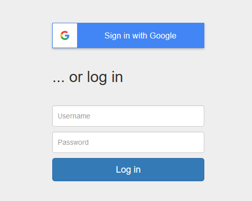
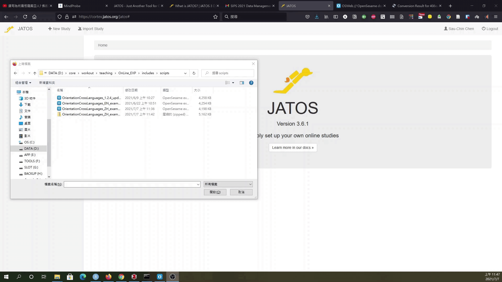
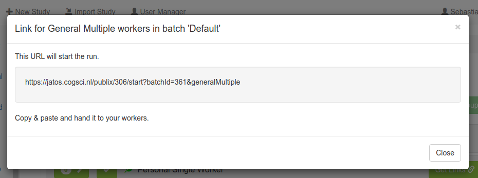
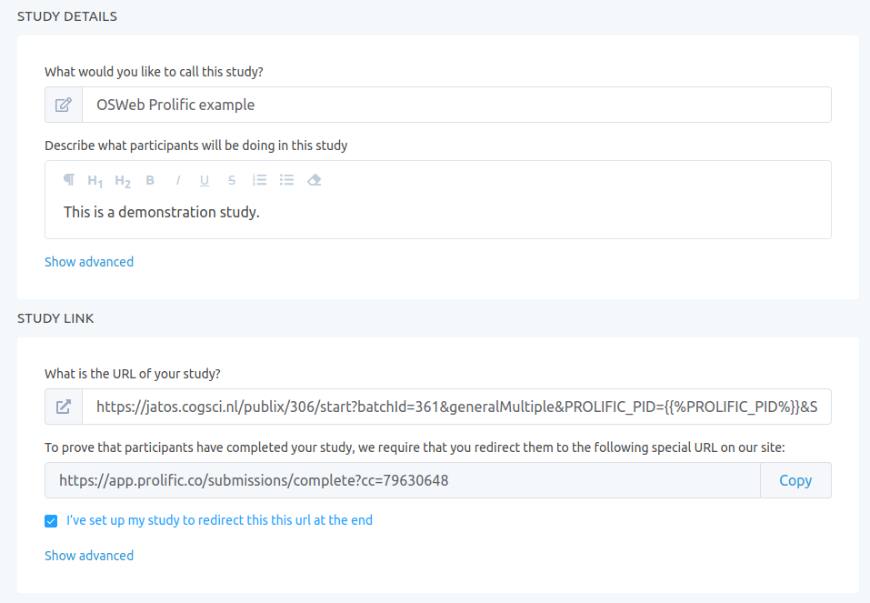
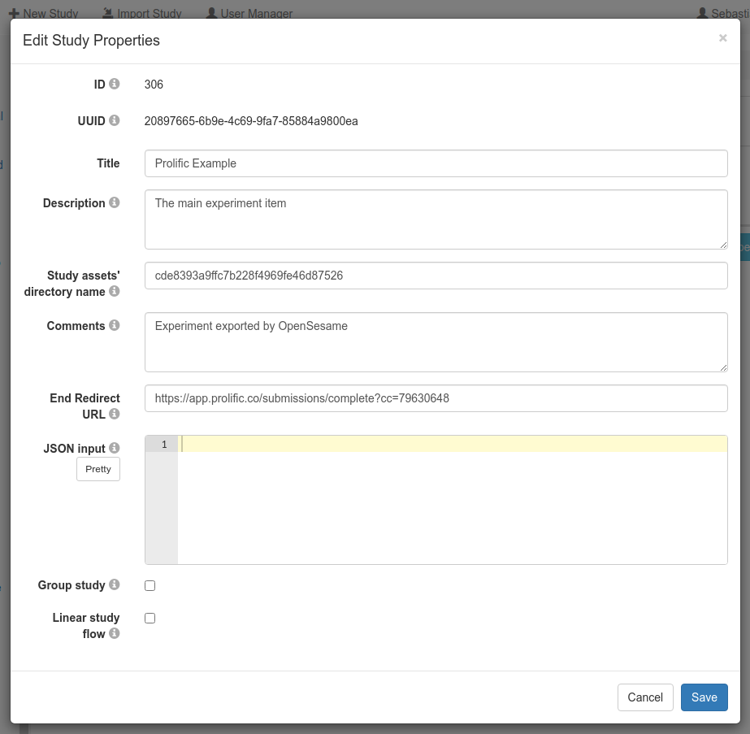
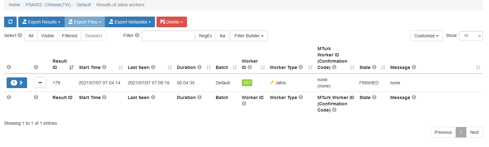

## JATOS伺服器

- 測試腳本專用伺服器[Cortex](https://cortex.jatos.org/)：自由註冊；系統每二十四小時自動重置，上傳的腳本會被刪除。

- 歐洲認知心理學會(ESCoP)支持的免費研究用伺服器[MindProbe](https://www.mindprobe.eu/)：自行寫信聯絡管理者註冊帳號；執行研究期間，要留意系統維護訊息。

JATOS網路伺服器開源程式是由德國Max Planck研究所 @langeJustAnotherTool2015  開發，讓研究人員能自行架設或租用網站伺服器，部署以javascript撰寫的實驗腳本，包括 [jsPsych](https://www.jspsych.org/), [lab.js](https://lab.js.org/), [OSWeb/OpenSesame](https://osdoc.cogsci.nl/), 以及[PsyToolkit](https://www.psytoolkit.org/)。

以下示範截圖來自測試腳本伺服器[Cortex](https://cortex.jatos.org/)。如果要正式部署實驗腳本收集資料，建議自行準備伺服器，或申請使用[MindProbe](https://www.mindprobe.eu/)。

1. 只要有google帳號，任何人都能自行註冊登入Cortex伺服器。



2. 初次登入的儀表板畫面。中間顯示JATOS版本，程式版本昇級時Cortex與MindProbe伺服器會最快更新，**自行維護的伺服器需要手動更新**。頂層按鈕可操作建立新實驗腳本(New Study)，匯入實驗腳本(Import Study)，個人帳戶資訊，以及登出(Logout)。


**註** 有更新版本時務必更新，否則參與者可能無法登入實驗網頁。  

## 匯出OSWeb腳本到JATOS

1. 在此以部署[示範腳本](includes/scripts/OrientationCrossLanguages_ZH_example.osexp)為例。開啟腳本後，經OpenSesame主選單"Tools -> OSWeb"切換到如以下截圖的畫面。
<br/>


- 操作面板功能說明

"Make browser fullscreen":匯出前建議勾選，參與者端執行時將自動切換為全螢幕模式。<br/>
"Test experiment in expernal browser": 在本地端測試腳本執行狀況，建議匯出前測試到符合計畫條件。<br/>
"Export experiement as JATOS study": 將腳本檔案轉換為可匯入JATOS伺服器的檔案。確認要匯出就按下這個按鍵，參考以下示範動畫。<br/>
"Convert JATOS results to csv/xlsx": 將從JATOS伺服器下載的結果檔案轉換為csv/xlsx檔案。<br/>
"Compatibility check": 確認腳本內元件設定無不相容JATOS伺服器的部分，務必保持"No probblems detected"再匯出腳本檔。<br/>
<br/>
2. 匯出腳本程序如以下gif動畫展示：<br/>
<br/>


3. 上一步匯出檔案成功後。到JATOS儀表板按下匯入實驗腳本(Import Study)，進行如以下gif動畫的步驟:<br/>
<br/>

<br/>
4. 匯入成功可由儀表板左側選單，切換到上傳成功的腳本專案操作介面。<br/>
<br/>


## JATOS設定部署方式

1. 按下專案介面的按鈕"Worker & Batch Manager"，開啟預設實驗網頁連結部署介面，展開"Default"左方箭頭，畫面如下截圖：


- 目前版本的JATOS支援五種部署方式，點擊右方"Get Link"按鈕，即可產生參與者能開啟實驗的網址。各種部署模式的圖標左方**勾選**之後，網址才能生效，停止實驗只要取消**勾選**。當實驗開始收集資料，左右兩邊顯示數字的按鈕，將顯示最新收集的紀錄數量。


- "Jatos Worker"是提供實驗者測試用的模式。其他模式的部署效果參考下表簡介，詳細說明請見官方[Worker type](http://www.jatos.org/Worker-Types.html)說明。

|模式|效果|
|---|---|
|Personal Single|特定參與者專屬實驗連結，一項連結只能登入一次。|
|Personal Multiple|特定參與者專屬實驗連結，一項連結能登入多次至關閉為止。|
|General Single|任何參與者皆能使用的實驗連結，一項連結只能登入一次。|
|General Multiple|任何參與者皆能使用的實驗連結，一項連結能登入多次至關閉為止。|
|MTurk|在Amazon MTurk平台招募參與者的實驗連結。|


2. "Worker & Batch Manager"介面可新增或刪除"Batch"，一個"Batch"相當於一群參與者。若是實驗要分派給不同地區的參與者，可設定"Batch"及實驗連結，輸出資料有Batch名稱。新增"Batch"只要在介面左上點選"New Batch"，在對話視窗輸入名稱即能新增；若要刪除Batch，從"Batch"介面右上選擇"More -> Delete"就能刪除。

### 在[Prolific](https://app.prolific.co/)收案的腳本設定

要紀錄Prolific的參與者ID及網站紀，可參考[JATOS官方說明](https://www.jatos.org/Use-Prolific.html)以及[OpenSesame使用者手冊](https://osdoc.cogsci.nl/3.3/manual/osweb/prolific/)的詳細設定。以下是簡易設 定步驟。

1. 在腳本的第一個`sequence`物件最先置入`inline_javascript`，執行區(Run)寫入以下程式碼

```
if (window.jatos && jatos.urlQueryParameters.PROLIFIC_PID) {
    console.log('Prolific information is available')
    vars.prolific_participant_id = jatos.urlQueryParameters.PROLIFIC_PID
    vars.prolific_study_id = jatos.urlQueryParameters.STUDY_ID
    vars.prolific_session_id = jatos.urlQueryParameters.SESSION_ID
} else {
    console.log('Prolific information is not available (setting values to -1)')
    vars.prolific_participant_id = -1
    vars.prolific_study_id = -1
    vars.prolific_session_id = -1
}
console.log('prolific_participant_id = ' + vars.prolific_participant_id)
console.log('prolific_study_id = ' + vars.prolific_study_id)
console.log('prolific_session_id = ' + vars.prolific_session_id)
```

2. JATOS端設定"General Multiple"，複製連結到Prolific案件設定網頁。連結格式如下圖：



3. 連結貼在Prolific案件設定網頁的指定欄位，其後再貼上以下程式碼：

```
&PROLIFIC_PID={}&STUDY_ID={}&SESSION_ID={}
```

完成後如同下圖：



複製上圖最後一欄生成的網址。

4. 正式公開Prolific案件前，回到JATOS端案件儀表板，開啟'Property'分頁，將上一步最後複製的網址，貼在**End Redirect URL**欄位。完成後如同下圖：




## 實驗資料匯出JATOS

1. 進入Results介面能執行匯出資料。點選專案介面任何一處"Results"按鈕都能進入，個人建議從"Worker & Batch Manager"介面，實驗者設定的實驗網址按鈕旁的"Results"進入，如此"Results"介面已經初步過濾可匯出資料。



2. 點選"Results"介面上方"Export Results"可匯出已存結果。JATOS提供兩種匯出方式：(1)**ALL** ~ 匯出所在這個Batch的所有紀錄；(2)**Selected** ~ 先自行選擇要匯出的紀錄，再點選匯出。

3. 若是經過第三方平台招募參與者，也要匯出metadata(點選"Export Metadata")，才能核對真正完成的紀錄。JATOS的metadata匯出後檔案格式是csv檔，相容大多數資料處理軟體。


## OSWeb實驗資料格式轉換

- 從JATOS匯出的純文字結果檔是json格式，透過OpenSesame的OSWeb 操作面板"Convert JATOS results to csv/xlsx"轉換為相容大多數資料處理軟體的格式。執行前建議勾選"Include JATOS context information"，操作方式請見以下動畫示範：


- 使用R或自由軟體(JASP, jamovi)處理資料的使用者，建議匯出格式為csv。


#### 上一步：[OSWeb腳本編輯](OS_script.html) &nbsp;&nbsp;&nbsp;&nbsp;&nbsp;&nbsp; 下一步：[OS資料處理示範](OS_data.html)


##### 參考文獻

