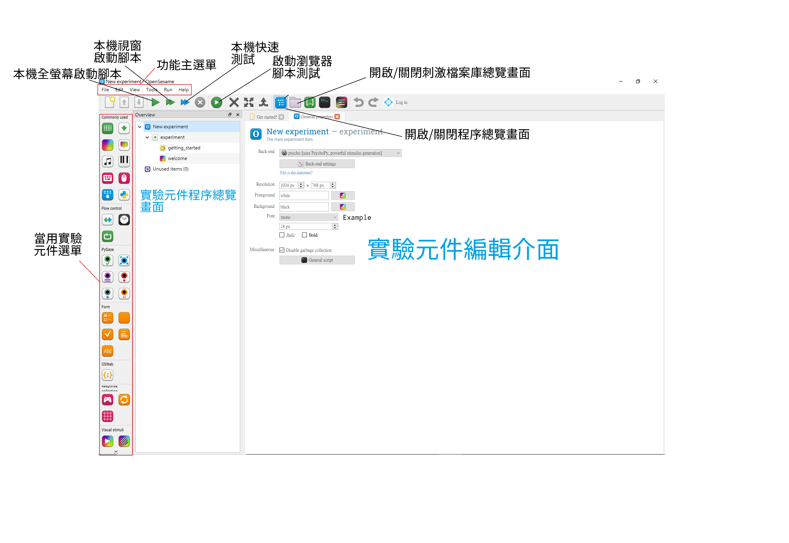
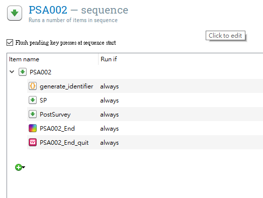
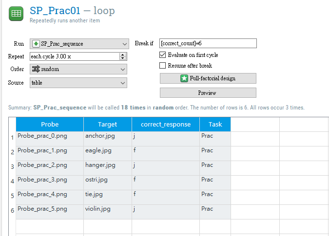
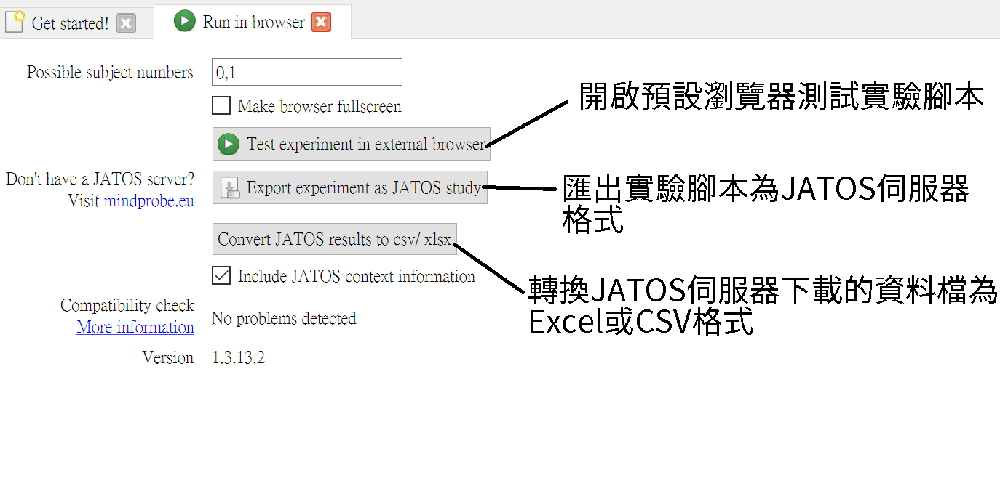

```{r setup, include=FALSE}
knitr::opts_chunk$set(echo = TRUE)
```

## 開發者資訊 

- 開發者Sebastiaan Mathôt等人發表於Behavior Research Methods volume的論文[@mathotOpenSesameOpensourceGraphical2012]，使用OpenSesame完成的研究報告務必引用這份論文。

- [使用者論壇](https://forum.cogsci.nl/)：與開發者及其他使用者交流使用心得與問題。

## 下載與安裝

#### [官方網站下載網頁](https://osdoc.cogsci.nl/3.3/download/)
- 依照使用者的作業系統，下載對應的安裝檔或免安裝壓縮檔。
  - **註** Windows 10執行安裝檔出現不建議安裝的訊息視窗時，選擇繼續安裝即可。
- 安裝方式如同多數應用程式，建議安裝目錄設置在實驗程式相關路徑。例如`D:\EXP_APP\OpenSesame`
- 官方推出更新版本時，到官方下載網頁下載安裝檔，重新執行安裝程序。
- OpenSesame使用Python開發，熟悉Python的使用者可透過下載Python函式庫的方式安裝於任何作業系統。


## 腳本編輯器介面

下圖是直接開啓OpenSesame的初始使用者介面，圖中註解有關編輯與測試實驗腳本的重要功能及選單。

```{r OS_top, echo=FALSE, message=FALSE, warning=FALSE, fig.cap="OpenSesame開啟畫面。"}

```

- 增加任何一個實驗元件到程序總覽畫面，可在編輯介面編輯元件內容。
- 程序總覽畫面內的元件由上而下依順序執行。
- 本機啟動或測試腳本，都會在腳本資料夾儲存結果(csv檔)。
- 啟動瀏覽器僅測試執行效果，不會儲存資料。
- 實驗程序要呈現圖片、聲音等外部媒體檔案，要放到刺激檔案總覽畫面之內。

### 必設定實驗元件

**一個腳本的程序由三種實驗元件構成**

 **腳本啟動元件**  <br/>
- 創建新腳本就存在的元件。
- 設定執行引擎(Back-end)、螢幕解析度(Resolution)、前景色(Foreground)、背景色(Background)、預設字型(Font)
 <br/> <br/>
 


 **執行序列控制元件** <br/>

- 第一個必設元件
- 置於序列元件下一層的元件依序執行
- `Run if`欄位設定元件行條件： always ~ 腳本啟動後必執行; never ~ 腳本啟動後不執行



  **迴圈序列控制元件** <br/>
- 設定一系列需要重覆執行的序列，例如連續的實驗嘗試。
- 上一階層必須設定**執行序列控制元件**
- 置於下一階層的**執行序列控制元件**是迴圈控制的重覆序列，例如實驗嘗試的刺激到反應事件。
- 可設定參數：停止條件(Break if); 最多重覆次數(Repeat); 呈現順序(Order); 內容來源(Source)



## OSWeb功能

- 主選單"Tools -> OSWeb"切換至OSWeb介面。按鈕功能如下圖說明：

```{r OSWeb, echo=FALSE, message=FALSE, warning=FALSE, fig.cap="OSWeb介面及功能說明，功能詳見範例示範。"}

```

#### &nbsp;&nbsp;&nbsp;&nbsp;&nbsp;&nbsp;&nbsp;&nbsp; 下一步：[腳本設計](OS_script.html)


##### 參考文獻

