```{r setup, include=FALSE}
knitr::opts_chunk$set(echo = TRUE)
library(captioner)

## I modified the codes from https://datascienceplus.com/r-markdown-how-to-number-and-reference-tables/

## Define the inline figure index
fig_nums <- captioner::captioner(prefix = "圖")

## List all the figure captions
fig.1_cap <- fig_nums(name = "fig_1",
                      caption = "主序列與次級序列，所有次級序列之下的實驗元件都會依序執行。")
fig.2_cap <- fig_nums(name = "fig_2",
                      caption = "設定不執行出口調查次級序列，點擊never文字可修改。")
fig.3_cap <- fig_nums(name = "fig_3",
                      caption = "經由滑鼠選單，選擇要增加實驗元件。")
fig.4_cap <- fig_nums(name = "fig_4",
                      caption = "結束畫面編輯介面。上半是圖像化編輯視窗；下半是腳本編輯視窗。兩種視窗都能編輯畫面呈現資訊。")
fig.5_cap <- fig_nums(name = "fig_5",
                      caption = "實驗作業序列元件一覽。")
fig.6_cap <- fig_nums(name = "fig_6",
                      caption = "指導語畫面編輯介面。由於部分句子長度超過螢幕寬度，指導語以圖檔呈現。")
fig.7_cap <- fig_nums(name = "fig_7",
                      caption = "練習序列元件編輯畫面，變數PList決定要執行的迴圈。")
fig.8_cap <- fig_nums(name = "fig_8",
                      caption = "練習序列元件內迴圈執行順序，序列元件SP_Prac_sequence以關聯式複製置入所有迴圈。")
fig.9_cap <- fig_nums(name = "fig_9",
                      caption = "練習迴圈元件編輯畫面，表格置入預定呈現的刺激及正確反應。")
fig.10_cap <- fig_nums(name = "fig_10",
                      caption = "練習嘗試序列元件編輯畫面，設定執行條件決定反應回饋訊息。")
fig.11_cap <- fig_nums(name = "fig_11",
                      caption = "正式實驗序列元件編輯畫面，變數List決定要執行的迴圈。")
fig.12_cap <- fig_nums(name = "fig_12",
                      caption = "正式實驗迴圈元件編輯畫面，表格置入預定呈現的刺激及正確反應。")
fig.13_cap <- fig_nums(name = "fig_13",
                      caption = "正式實驗嘗試序列元件編輯畫面，設定執行條件決定反應回饋訊息。")
fig.14_cap <- fig_nums(name = "fig_14",
                      caption = "出口調查序列元件一覽。Post_info呈現調查說明，Survey迴圈依序執行調查問題，")
fig.15_cap <- fig_nums(name = "fig_15",
                      caption = "Survey迴圈元件編輯畫面，表格置入調查問題與選項。")
fig.16_cap <- fig_nums(name = "fig_16",
                      caption = "Survey_seq序列元件一覽。")

## Extract the figure number for inline code
f.ref <- function(x) {
  stringr::str_extract(fig_nums(x), "[^:]*")
}
```

**請先下載[示範腳本](includes/scripts/OrientationCrossLanguages_ZH_example.osexp)**

## 簡介句圖比對作業

句圖比對作業(sentence-picture verification task)用於探討人類能否以視覺經驗理解句子，過去發現顯示閱讀描述物體的句子，暗示形狀、顏色、與方向等視覺屬性，判斷的物體圖片與脈絡一致，反應快於不一致的物體圖片[@connellRepresentingObjectColour2007; @stanfield_effect_2001; @zwaanRevisitingMentalSimulation2012; @zwaanLanguageComprehendersMentally2002]。在此以 @stanfield_effect_2001 的程序示範OpenSesame腳本編輯，[示範腳本](includes/scripts/OrientationCrossLanguages_ZH_example.osexp)源自 @chenInvestigatingObjectOrientation2018 使用的繁體中文版實驗。示範說明依照序列(sequence)階層排列，建議學習者下載示範腳本後，按照以下說明調整測試，學習建構腳本的技巧。

<span style="background-color: #FFFF00">
**OSWeb顯示中文字的限制**<br/>  
OpenSesame以HTML語法控制在螢幕呈現的文字，如果是中文字且一行文字長度超出螢幕寬度，目前的版本(v3.3)無法自動斷行。因此目前所有中文字的指導語及刺激項目，都需要事先轉換為PNG圖檔，置入要呈現的序列或迴圈元件。
</span>


# 建立主序列

`r f.ref('fig_1')`展示句圖比對作業的主序列`PSA002`之下的實驗元件，主序列元件之下的實驗元件依順序執行，這個實驗程序有兩個次級序列：`SP`實驗作業；`PostSurvey`出口調查。每個實驗元件可設定執行條件`Run if`，預設總是執行(always)，若要跳過某個元件不執行，只要點轉對應的`Run if`欄位文字，改成永不執行(never)。

```{r main_seq01, echo=FALSE, fig.cap = fig.1_cap}
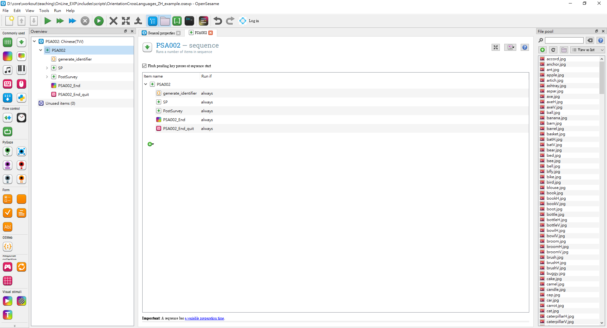
```


```{r main_seq02, echo=FALSE, fig.cap = fig.2_cap}
knitr::include_graphics("includes/img/main_seq02.png")
```

序列元件是唯一可置入其他實驗元件到下一階層的實驗元件。方法有從左側常用實驗元件拖曳要加入的實驗元件，或者在要增加元件的序列點擊滑鼠右鍵，開啓選單選擇要置入的實驗元件。

```{r main_seq03, echo=FALSE, fig.cap = fig.3_cap}
knitr::include_graphics("includes/img/main_seq03.png")
```

**完成代碼產生器**

"OSWeb"支授以javascript編譯的自訂程序，在序列之下置入`inline javascript`實驗元件  。進入`inline javascript`實驗元件編輯介面，直接編輯程式碼。**註** <span style="background-color: #FFFF00">javascript程式碼執行成果只能在網頁瀏覽器檢視。</span>

任何網路實驗應提供參與者實驗完成代碼，以供核實參與紀錄。使用javascript內建的亂數產生器，可提供每位實驗者專屬完成代碼。示範腳本`generate_identifier`實驗元件的javascript程式碼如下一行展示：

```
vars.identifier = Math.random().toString(36).substr(2, 9);
```

主序列完成執行`generate_identifier`，會將完成碼存入變數`identifier`。實驗結束前最後一個執行的實驗元件`PSA002_End`，在視窗呈現完成代碼。`PSA002_End`是標準的"sketchpad"元件，仼何要呈現在螢幕呈現的訊息或刺激，均可在這個元件設定。`r f.ref('fig_4')`展示`PSA002_End`編輯介面，變數`identifier`呈現在畫面中間位置。

**註：** 這個sketchpad變數"duration"設定是0，以及是腳本內唯一呈現中文字的畫面。比較其他序列之內的sketchpad設定差異。


```{r main_seq04, echo=FALSE, fig.cap = fig.4_cap}
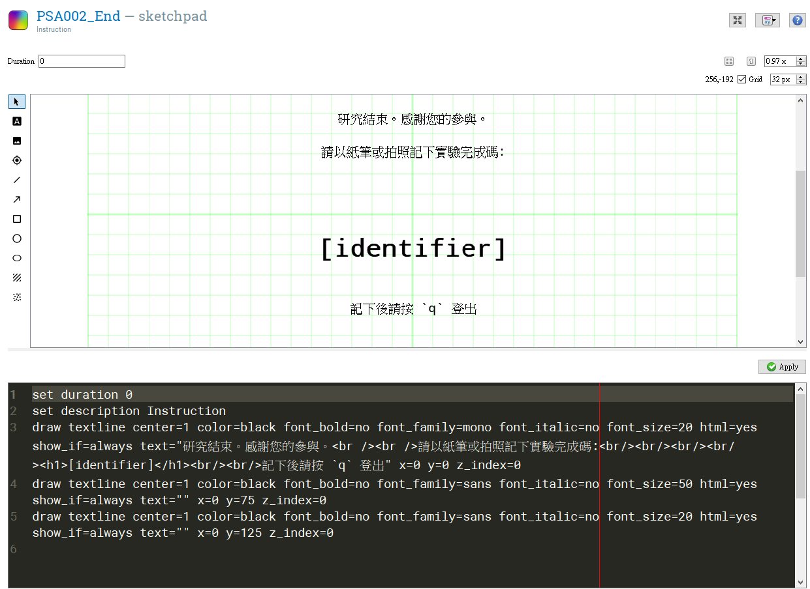
```


# 實驗作業序列

實驗作業程序首先執行`SP_list_random`，產生兩個變數`[Plist]`與`[List]`的數值，提供下層序列`SP_Practice`與`SP_Task`要執行那一個迴圈，每個迴圈差異在於設定的刺激列表。執行後先進行一段預訂六次嘗試的練習，再進行48次嘗試的正式實驗。練習與正式實驗程序分別以`SP_Practice`與`SP_Task`序列控制。兩段序列執行前都有置入sketchpad元件`SP_Instruction`與`SP_Start`，呈現說明反應方式的指導語。


```{r exp_seq01, echo=FALSE, fig.cap = fig.5_cap}
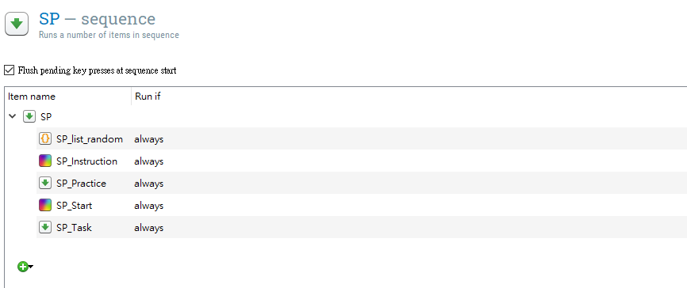
```

**實驗刺激列表**

為了達成交互平衡控制，練習有兩份刺激列表，正式實驗有四份刺激列表。每份激列表分別放置於迴圈物件(loop)，執行練習與正式實驗序列之前，先經過隨機洗牌決定要執行的迴圈物件序號。練習與正式實驗的迴圈物件編輯介面如`r `與`r `，決定序號的javascript程式碼如下，變數`PList`，`List`分別儲存隨機決定的序號號碼：

```
// getRndInteger(min, max) returns a random number between min and max (both included):
function getRndInteger(min, max) {
  return Math.floor(Math.random() * (max - min + 1) ) + min;
}

vars.List = getRndInteger(1,4);
vars.PList = getRndInteger(1,2);
```

**指導語畫面**

指導語的skatchpad呈現即將開始的作業序列，必須要注意的事項。比較`r f.ref('fig_6')`與`r f.ref('fig_4')`，指導語畫面與結束畫面有兩點不同：(1) 指導語畫面的"duration"設定"keypress"，以參與者按下按鍵切換畫面。結束畫面的"duration"設定0，以下一個按鍵元件設定切換畫面；(2) 指導語畫面呈現圖檔，腳本內"draw image"一行可設定指定圖檔，呈現位置，以及呈現條件`show_if`。結束畫面呈現文字，腳本內"draw textline"一行可設定文字內容(支援html語法)，設定字型，呈現位置，以及呈現條件`show_if`。

```{r exp_seq02, echo=FALSE, fig.cap = fig.6_cap}
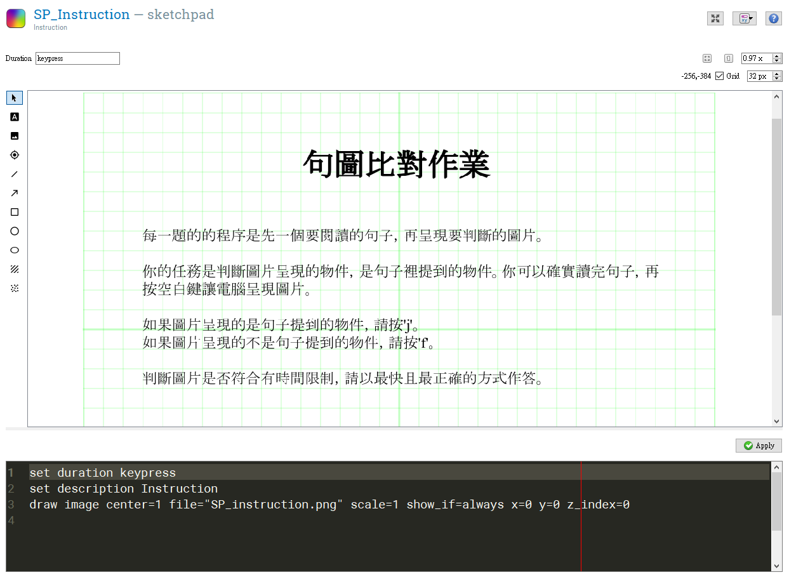
```


## 練習序列

`r f.ref('fig_7')`展示練習序列兩個迴圈，`SP_Prac01`, `SP_Prac02`，兩者差異僅在於刺激表單內容。從"Run if"設定變數`[PList]`(數值來自`SP_list_random`)決定要執行那一個迴圈。

```{r exp_seq03, echo=FALSE, fig.cap = fig.7_cap}
knitr::include_graphics("includes/img/exp_seq03.png")
```

**練習迴圈**


`r f.ref('fig_8')`展示其中一個迴圈`SP_Prac01`之下的序列串連的實驗元件。練習迴圈設定參與者要答對所有題目才能結束，否則重新開始。這項設定由三個`inline javascript`控制，`Prac_setup`設定正確紀錄計數器，`Prac_Reset`負責重設正確紀錄計數器，`Prac_Count`累進正確反應到正確紀錄計數器。留意每一個`inline javascript`都是放置在一項序列。

```{r exp_seq04, echo=FALSE, fig.cap = fig.8_cap}
knitr::include_graphics("includes/img/exp_seq04.png")
```


`r f.ref('fig_9')`展示`SP_Prac01`編輯介面。要注意的參數有：

`Repeat`: 設定最多重覆次數。<br/>
`Order`: sequential ~ 刺激依表格順序呈現。<br/>
`Break if`: 設定迴圈停止條件。`[correct_count]=6`表示正確反應累進達6次即停止。<br/>
`Source`: 刺激來源。table ~ 迴圈編輯介面的表格; file ~ 另存於"file pool"內的格式化文字檔，通常是csv格式。<br/>

**刺激表單欄位說明**

"Probe": 提供實驗元件`Probe_Prac`呈現的刺激句<br/>
"Target": 提供實驗元件`Target_Prac`呈現的目標圖像<br/>
"correct_response": 對應`Target_response_Prac`的參數"correct_response"<br/>
"Task": 匯出紀錄檔標記反應資料來源為"Prac"

```{r exp_seq05, echo=FALSE, fig.cap = fig.9_cap}
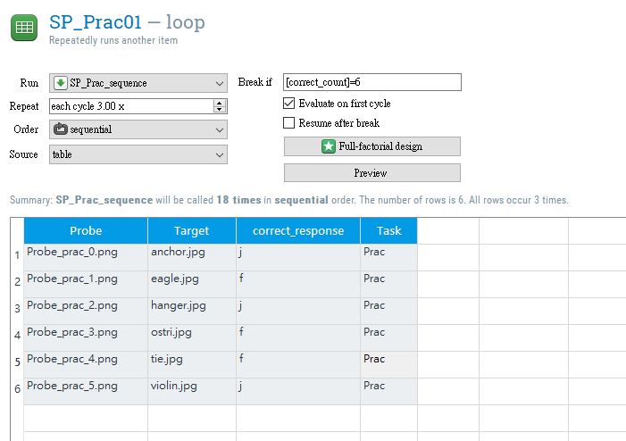
```

迴圈`SP_Prac01`與迴圈`SP_Prac02`之下都是序列`SP_Prac_sequence`，製作程序是先在其中一個迴圈完成編輯，再使用<span style="background-color: #FFFF00">關聯式複製`Copy(Linked)`</span>，拷貝到另一個迴圈。之後只要修改其中一個迴圈之下的序列，另一個迴圈之下的序列同步變更。這種方式適用不同迴圈執行程序相同的腳本，仼何實驗元件都能使用關聯式複製，只要以滑鼠右鍵點擊要複製的元件，就能從選單選擇<span style="background-color: #FFFF00">關聯式複製`Copy(Linked)`</span>(見下圖)。

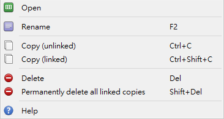


**練習嘗試**


`r f.ref('fig_10')` 陳列`Prac_trial`序列的所有實驗元件。`Prac_trial`構成一次練習嘗試參與者依序經歷的所有事件，下列標示的元件名稱搭配說明執行設定： <br/>
<br/>

```{r exp_seq06, echo=FALSE, fig.cap = fig.10_cap}
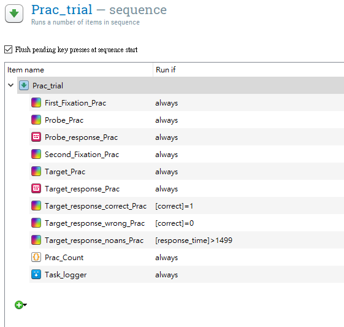
```


> 點擊實驗元件，開啟編輯介面，切換"split view"可檢視圖形介面與腳本參數。重要參數設定見以下截圖內標示。

1. 第一次凝視點`First_Fixation_Prac`呈現1000毫秒

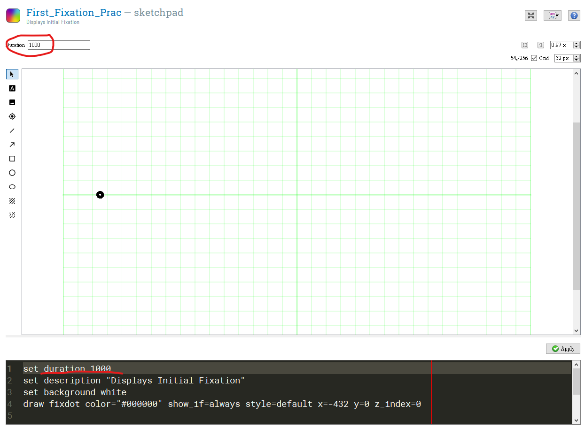

2. `Probe_prac`呈現刺激句，刺激句來自迴圈內選單欄位[Probe]；`Probe_response_prac`參與者充分閱讀後按下指定反應鍵

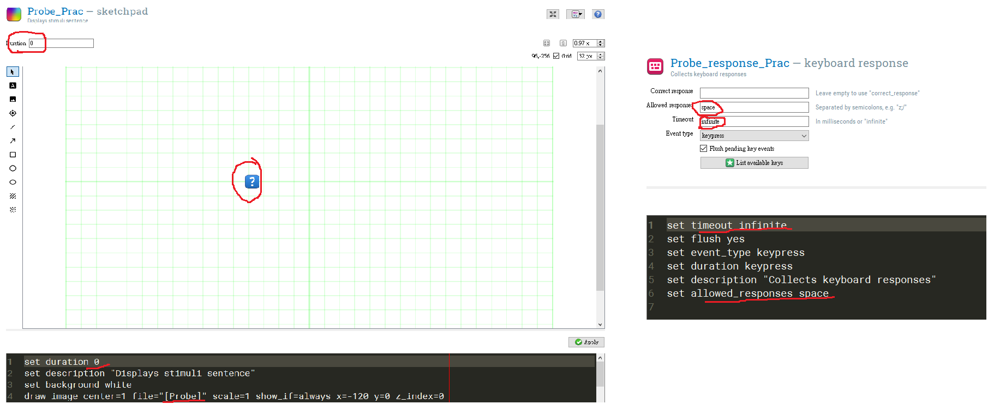

3. 第二次凝視點`Second_Fixation_Prac`呈現500毫秒


4. `Target_Prac`呈現目標物件圖像，物件圖像來自迴圈內選單欄位[Target]；`Target_response_Prac`參與者要在限時2000毫秒內按下指定反應鍵"j"或"f"

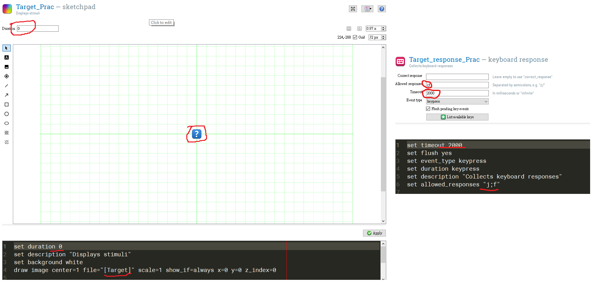

5. 根據反應結果呈現500毫秒的回饋訊息：**正確**([correct]=1)`Target_response_correct_Prac`；**錯誤**([correct]=0)`Target_response_wrong_Prac`；**反應太慢**([response_time]>1499)`Target_response_noans_Prac`


6. 正確次數紀錄器`Prac_Count`，正確次數紀錄於[correct_count]，累積達6即中止迴圈，有錯誤即歸零

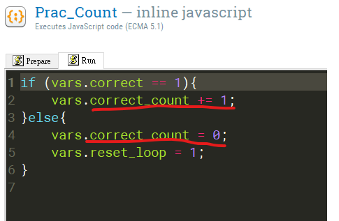

7. 實驗嘗試紀錄`Task_logger`：此物件必須放置於在嘗試最底層迴圈的最底層序列最後位，OpenSesame/OSWeb才能逐次輸出紀錄。

- 3.3.9版調整`logger`元件記錄欄件數量，建議以自訂模式設置需要分析的欄位，以下截圖是示範腳本設定的欄位。控制視窗一次只能設定，可看到設定的欄位儲存那些實驗元件的資料，例如在`inline javascript`內設定的變數都是"custom"。需要設定的欄位數目太多，可從腳本視窗依格式新增。

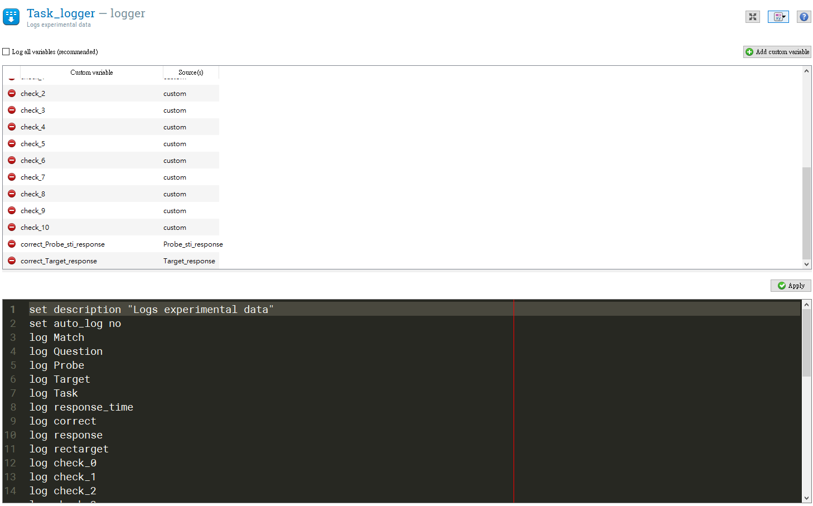

## 實驗序列

`r f.ref('fig_11')` 展示正式實驗序列四個迴圈，`SP_list01`, `SP_list02`, `SP_list03`, `SP_list04`，四者差異僅在於刺激表單內容。從"Run if"設定變數`[List]`(數值來自`SP_list_random`)決定要執行那一個迴圈。

```{r exp_seq07, echo=FALSE, fig.cap = fig.11_cap}
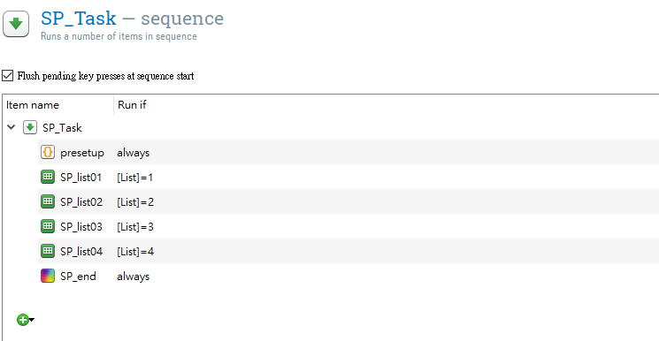
```

執行正式實驗序列之前，`presetup`準備執行記憶檢測題需要的變數。javascript程式碼內變數及註解如下：

```
// 自訂函式，從任意最小及最大數值之間取得一個數值:
function getRndInteger(min, max) {
  return Math.floor(Math.random() * (max - min + 1) ) + min;
}

// 儲存已呈現的刺激句檔案
vars.probe_list = [];
// 已執行的實驗嘗試次數紀錄器
vars.trial_seq = 0;

// probe_list儲存刺激數紀錄器，數值大於5即執行`Probe_import`的程式碼
let list_length; 

// 記憶檢測呈現的刺激句檔案
vars.rectarget = 'Probe_filler_0.png';

// 執行記憶檢測的實驗嘗試順序
// 每個變數儲存隨機函式結果，其中之一等於trial_seq，該次嘗試就執行記憶檢測
vars.check_0 = getRndInteger(7,9);
vars.check_1 = getRndInteger(10,12);
vars.check_2 = getRndInteger(13,15);
vars.check_3 = getRndInteger(17,19);
vars.check_4 = getRndInteger(21,23);
vars.check_5 = getRndInteger(25,27);
vars.check_6 = getRndInteger(29,31);
vars.check_7 = getRndInteger(33,35);
vars.check_8 = getRndInteger(37,39);
vars.check_9 = getRndInteger(41,43);
vars.check_10 = getRndInteger(45,47);
```


**實驗迴圈**


`r f.ref('fig_12')`展示`SP_list01`編輯介面。要注意的參數有：

`Repeat`: 只執行1次。<br/>
`Order`: random ~ 刺激依隨機順序呈現。<br/>
`Break if`: 設定迴圈停止條件。`never`表示直到所有刺激呈現完畢。<br/>
`Source`: 刺激來源。table ~ 迴圈編輯介面的表格。<br/>

**刺激表單欄位說明**

"Orientation": 目標物件圖像呈現方向。H ~ 水平, V ~ 垂直, F ~ 填充<br/>
"Match": 刺激句暗示方向與目標物件圖像呈現方向是否一致。Y ~ 一致, N ~ 不一致, F ~ 填充<br/>
"Probe": 提供實驗元件`Probe`呈現的刺激句<br/>
"Target": 提供實驗元件`Target`呈現的目標圖像<br/>
"correct_response": 對應`Target_response`的參數"correct_response"<br/>
"Task": 匯出紀錄檔標記反應資料來源為"SP"

```{r exp_seq08, echo=FALSE, fig.cap = fig.12_cap}
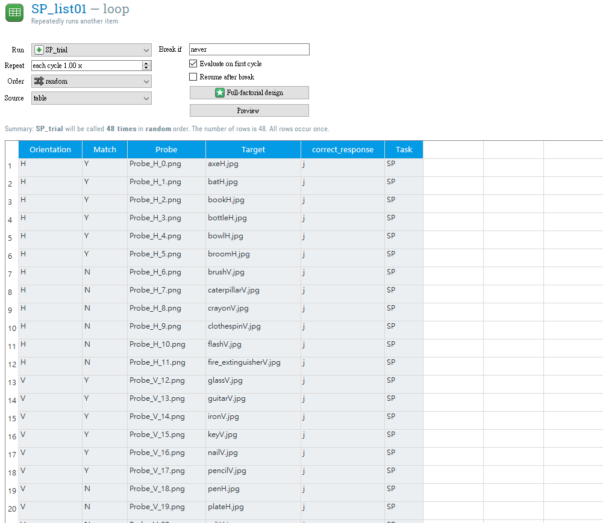
```


**實驗嘗試**


`r f.ref('fig_13')` 陳列`SP_trial`序列的所有實驗元件。`SP_trial`構成一次實驗嘗試參與者依序經歷的所有事件，除了memory check，多數元件設定與`Prac_trial`相同。下列標示的元件名稱搭配說明執行設定： <br/>

<br/>

```{r exp_seq09, echo=FALSE, fig.cap = fig.13_cap}
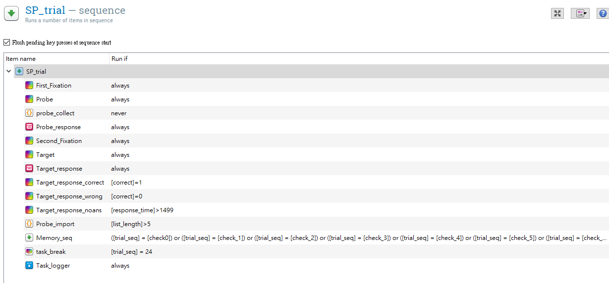
```


<br/>

1. 第一次凝視點`First_Fixation`呈現1000毫秒
2. 呈現刺激句`Probe`，參與者充分閱讀後按下指定反應鍵`Probe_response`
  - 收集已呈現的刺激句`probe_collect`為後續memory check預備，參考以下javascript程式碼註解說明

```
// 己呈現的刺激句存入probe_list
if(vars.probe_list.length == 0){
// 存入第一次嘗試刺激句
   vars.probe_list.splice(1,0,vars.Probe);
} else if (vars.probe_list.length > 0 & vars.probe_list.length < 6) {
// 存入刺激句滿6個之前的程序
   vars.probe_list.unshift(vars.Probe);
} else {
// 存入刺激句滿6個後，先移除最早存入的刺激句，再存入最新的刺激句
   vars.probe_list.pop();
   vars.probe_list.unshift(vars.Probe);
}
// 記錄此次嘗試probe_list已存數值個數 
vars.list_length = vars.probe_list.length;
// 實驗嘗試次數累進
vars.trial_seq += 1;
```
  
3. 第二次凝視點`Second_Fixation`呈現500毫秒
4. 呈現目標物件圖像`Target`，參與者充分閱讀後按下指定反應鍵`Target_response`
5. 根據反應結果呈現回饋訊息：**正確**([correct]=1)`Target_response_correct`；**錯誤**([correct]=0)`Target_response_wrong`；**反應太慢**([response_time]>1499)`Target_response_noans`
  - `Probe_import`挑選要呈現於memory check的刺激句，從第六次嘗試開始執行([list_length]>5)，參考以下javascript程式碼註解說明

```
// 自訂函式，從任意最小及最大數值之間取得一個數值:
function getRndInteger(min, max) {
  return Math.floor(Math.random() * (max - min + 1) ) + min;
}

// 決定probe_list的位置序號
vars.anchor = getRndInteger(0,5);

// 依anchor位置序號，從probe_list載入該序號的刺激檔案至rectarget
// 序列`Memory_seq`下元件`Probe_sti`呈現rectarget
vars.rectarget = vars.probe_list[vars.anchor];

// 設定`Probe_sti_response`正確反應按鍵，小於3為"是"，否則為"否"
if(vars.anchor < 3) {
		vars.correct_response = 'j';
}
else{
		vars.correct_response = 'f';
}
```

6. 序列`Memory_seq`執行memory check。"Run if"設定其中11次嘗試執行，每次實驗要執行的嘗試由`presetup`決定(見`r f.ref('fig_11')`)。
  - 序列內元件：`Probe_sti`不限時呈現刺激句及問題；`Probe_sti_response`等待反應；反應後回饋**正確**([correct]=1)`Probe_sti_correct`；**錯誤**([correct]=0)`Probe_sti_wrong` 各元件設定同`Target`,`Target_response`,`Target_response_correct`,`Target_response_wrong`<br/>
  
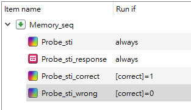

7. `task_break`中間休息提示，在第24次嘗試後顯示([trial_seq] = 24)，呈現時間無限制
8. 實驗嘗試紀錄`Task_logger`：從`Prac_trial`**關聯性複製**

- 輸入`Task_logger`的多數欄位都是紀錄實驗序列的重要變項，例如：由於其中11次嘗試有記憶檢測，兩種嘗試反應的正誤紀錄分別儲存於"correct_Probe_sti_response"與"correct_Target_response"欄位。

# 出口調查序列

**建議1** 問卷題目建議使用表單網頁呈現，例如google form。
**建議2** 本範例僅調查參與者性別與出生年，題目皆為單選題。

`r f.ref('fig_14')` 顯示出口調查序列`PostSurvey`的元件。


```{r post_seq01, echo=FALSE, fig.cap = fig.14_cap}
knitr::include_graphics("includes/img/post_seq01.png")
```

`Post_info`呈現已到最後段落的訊息。設定與正式實驗指導語呈現元件`SP_Instruction`,`SP_Start`相同。

## 題目迴圈

`r f.ref('fig_15')` 呈現調查題目迴圈`Survey`，參數設定大致與練習嘗試迴圈`SP_Practice`相同，除了"Repeat"與"Break if"是元件預設。表單內欄位"Question"與"Options"置入要呈現的題目與作答選項說明，依序呈現於題目序列`Survey_seq`的`Survey_board`。


```{r post_seq02, echo=FALSE, fig.cap = fig.15_cap}
knitr::include_graphics("includes/img/post_seq02.png")
```


## 題目序列

`r f.ref('fig_16')`展示調查執行序列`Survey_seq`，題目只有一套，執行三項題目即結束。


```{r post_seq03, echo=FALSE, fig.cap = fig.16_cap}
knitr::include_graphics("includes/img/post_seq03.png")
```

1. `Survey_Board`呈現題目與作答選項，題目迴圈`Survey`內選單欄位[Question]與[Options]；`Survey_response`說定可作答的按鍵，無回答時間限制。

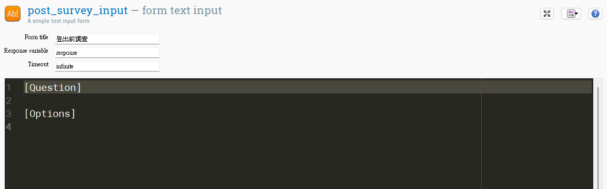

2. 實驗嘗試紀錄`Task_logger`：從`Prac_trial`**關聯性複製**

#### 上一步：[Open Sesame開工預備](OS_intro.html) &nbsp;&nbsp;&nbsp;&nbsp;&nbsp;&nbsp; 下一步：[JATOS部署與測試](OS_OSWeb.html)
<br/>

##### 參考文獻
