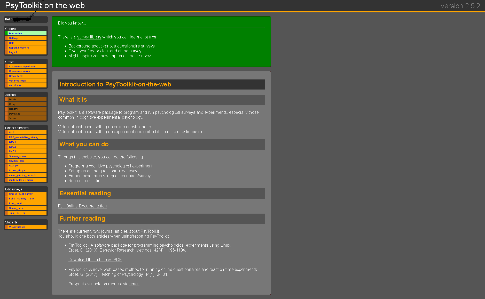

```{r setup, include=FALSE}
knitr::opts_chunk$set(echo = TRUE)
```

## 開發者資訊 

- 開發者Gijsbert Stoet教授發表於Behavior Research Methods[@Stoet-2010]及Teaching of Psychology的論文[@Stoet-2017]，使用Psytoolkit完成的研究報告務必引用這兩份論文。

- [開發者聯絡方式](https://www.psytoolkit.org/contact.html):詢問使用問題；建議；商業使用洽詢；教學用途洽詢。  

- [使用者論壇](http://psytoolkit.boards.net/)：與開發者及其他使用者交流使用心得與問題；徵求實驗參與者。

- 任何使用者可經[官方登入頁面](https://www.psytoolkit.org/#_web_based_login)免費註冊帳號，線上管理與執行問卷與實驗腳本。官方登入頁面連結為最新版本。**註** 2021年七月起除了歐洲伺服器，增加美國伺服器。使用者可自行選擇要在那個伺服器註冊，兩者的帳戶資料彼此獨立。


## 註冊/登入畫面介紹

最新版有部署於歐洲及美國兩地的伺服器，任何人都可以註冊使用，但是兩個伺服器的資料互不流通。建議使用者根據**目標參與者的所在地區**，使用最接近的伺服器。

![2023冬季登入畫面截圖。實際畫面以官方網站為準。]

  


### 左側常駐功能列

**General** Psytoolkit版本資訊；帳號設定；求助；詢問；登出。<br/>
**Create** 建立實驗腳本；建立問卷腳本；建立實驗刺激列表；取得官方腳本；取得其他使用者實驗腳本。<br/>
**Actions** 己建腳本可執行的管理動作。刪除正在編輯的腳本；拷貝其他腳本至正在編輯腳本；更改正在編輯的腳本名稱；下載正在編輯的腳本；分享正在編輯腳本給其他使用者(目前只限實驗腳本)。

## 帳號設定畫面(Settings)


- **Disk space** 帳號資料已用儲存空間資料<br/>  
- **Teacher(for use in calss)**<br/> 使用者是學生，可在此填入教師註冊psytoolkit的e-mail帳號。<br/>
使用者是老師，可勾選`Click here if you are a teacher.`，開啟學生活動檢視頁面。  <br/>
- **Various** 進階設定。腳本編輯視窗顯示行號；已編輯腳本排序方式；腳本編輯畫面起始設定。  


## 教師線上協助

<span style="background-color: #FFFF00">
**小提示：psytoolkit的腳本名稱必須為英文**
</span>

使用者如果有教師協助學習，可在帳號設定加入教師的psytoolkit帳號。之後教師可從自已的登入畫面，瀏覽及複製學生編輯的**實驗腳本**，協助學生排助遇到的問題。

<span style="background-color: #FFFF00">
由於**問卷腳本**執行核心不同於**實驗腳本**，網站尚未提供線上批改。有需要的老師與學生建議使用其他協作平台如google doc, HackMD作業。
</span>


當學生在psytoolkit帳號設定加入教師的帳號之後，教師從`View students`連結查看學生帳號清單，每個學生帳號連結到學生已建立的實驗腳本活動頁面。


有學生告知教師問題，教師可登入該學生的活動頁面，觀看學生的已建立的腳本清單。下方截圖是其中一位學生已建立的實驗腳本清單，**Activity**之下未擷圖部分是學生的帳號活動紀錄。


「詞彙判斷作業」是教師指派的作業，教師可進入以下截圖頁面，複製腳本至教師帳號檢查，再回覆學生解決問題的方法。


## 其他介紹

- 佛光大學周蔚倫老師製作的教學示範影片

<iframe width="560" height="315" src="https://www.youtube-nocookie.com/embed/BzBpmu_w2AU" title="YouTube video player" frameborder="0" allow="accelerometer; autoplay; clipboard-write; encrypted-media; gyroscope; picture-in-picture" allowfullscreen></iframe>

<iframe width="560" height="315" src="https://www.youtube-nocookie.com/embed/HOfhZE5gCzA" title="YouTube video player" frameborder="0" allow="accelerometer; autoplay; clipboard-write; encrypted-media; gyroscope; picture-in-picture" allowfullscreen></iframe>


#### &nbsp;&nbsp;&nbsp;&nbsp;&nbsp;&nbsp;&nbsp;&nbsp;&nbsp;&nbsp;&nbsp; 下一步：[線上問卷](PsyT_survey.html)

##### 參考文獻


